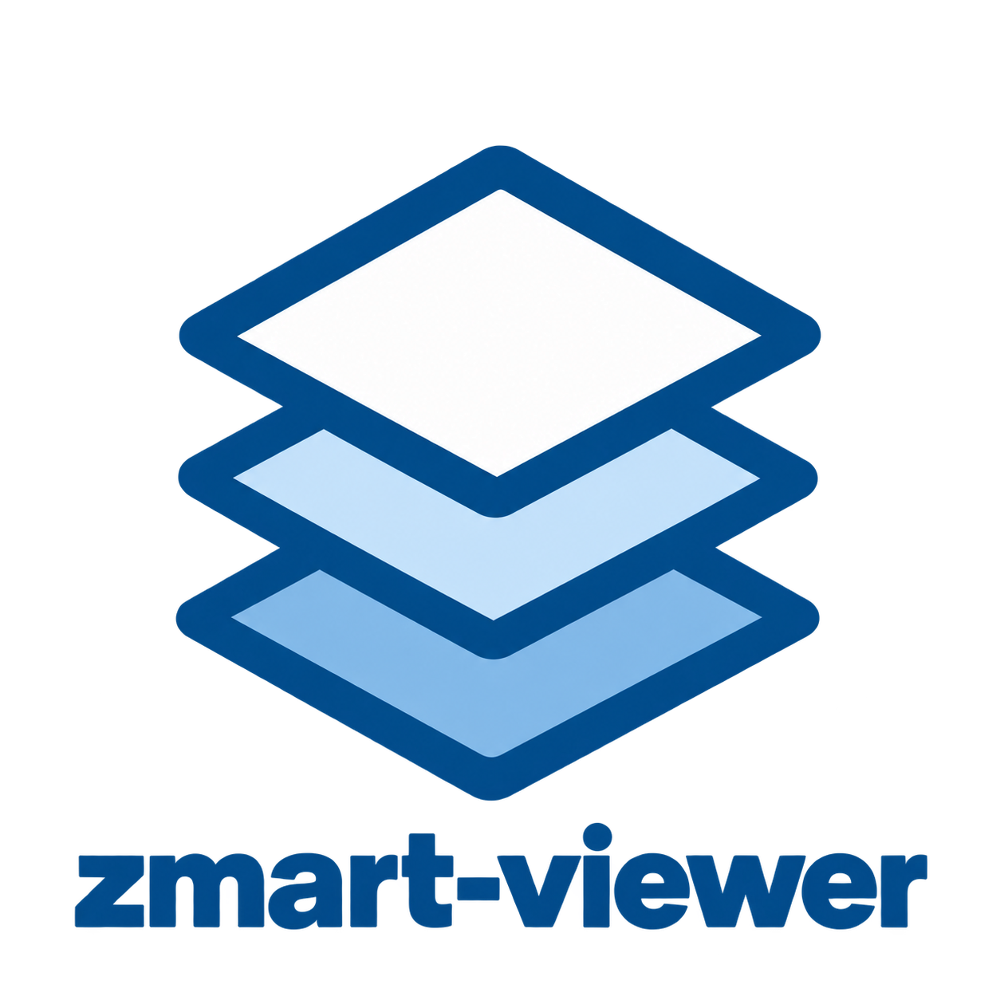

# ZMART Viewer

[](https://www.python.org/downloads/)
[](LICENSE)
[](docs/how_it_works/TESTING.md)
[](#status)



The **ZMART Viewer** shows large, three-dimensional, multi-channel microscopy images,
and keeps showing them while the microscope is still writing. Point it at a folder of
OME-Zarr images and it draws what is there; new positions and new time points appear
on their own. It is part of [**ZMART**](https://github.com/thomdehoog/ZMART-microscopy) (ZMB's Microscopy-Agnostic Research Toolkit),
the tools we use for smart microscopy at the Center for Microscopy and Image Analysis
(ZMB), University of Zurich.
<br clear="left"/>

## The Problem

A smart-microscopy run produces images that are too large to load, that arrive
while the experiment is running, and that come as hundreds or thousands of positions
which only make sense when they are placed where they were taken on the stage.
Most viewers open one finished file at a time. During an experiment we need to see
the whole specimen grow, and we need the same picture inside the interface that
drives the microscope.

## The Solution

The ZMART Viewer is two things in one repository:

1. **A viewing engine** (`engine/`, installed as the Python package `zmart_viewer`).
   It reads OME-Zarr images, places each position where it belongs, follows a
   folder while a microscope writes into it, and serves only the pieces of the
   picture that are on screen, so even enormous data feels light. It draws through
   [neuroglancer](https://github.com/google/neuroglancer) with neuroglancer's own
   controls switched off, and it offers named views of an acquisition: **Slice**
   (one plane at a time), **Top** (the surface seen from above) and
   **Min/Max/Sum** projections.

2. **A window** (`gui/`). Sliders through depth (Z) and time (T), a panel
   to set each channel's colour and contrast, a load window to choose data, and a
   3-D view. It opens as its own desktop window and never talks to a microscope,
   so it can be used on anybody's data, on any machine, with no possibility of
   disturbing an experiment.

Smart-microscopy interfaces use the engine and bring their own window. The ZMART
operator window in [ZMART Microscopy](https://github.com/thomdehoog/ZMART-microscopy)
does exactly that. Anyone else uses the window that comes with this package.

### What you can do

From a terminal, once the package is installed:

```bash
# Open an empty viewer and choose a folder from inside it
zmart-viewer

# Open one image, or a folder holding many positions of one acquisition
zmart-viewer /path/to/run

# Watch a run that is being written right now (the default), or say it is finished
zmart-viewer /path/to/run
zmart-viewer /path/to/run --static

# Print an address instead of opening a window, for a remote desktop or a browser
zmart-viewer /path/to/run --no-window
```

From your own software, to put the picture inside your own interface:

```python
from zmart_viewer import make_server

# 1) Start the engine on a port of the machine's choosing, watching a folder
server = make_server(port=0, data_dir="/path/to/run", live=True)

# 2) Tell it when an acquisition has finished writing (optional, but better than guessing)
#    POST http://127.0.0.1:<port>/api/announce     {"publications": [...]}

# 3) Put the named views on your own canvas with the embedding script it serves
#    <script type="module"> import { viewChoices } from "http://127.0.0.1:<port>/embedding.js" </script>
```

The engine answers over HTTP, so an interface can be written in any language.
The details are in [Inside your own interface](docs/inside-your-own-interface.md).

## Try it yourself

- [Install it and open your first images](docs/using-the-viewer.md)
- [Use the engine inside your own interface](docs/inside-your-own-interface.md)
- [The embedding API for named views](docs/embedding.md) and [what the named views are](docs/view_modes.md)
- [How it works](docs/how_it_works/ARCHITECTURE.md): the design, the file layout on disk, and [how to run the tests](docs/how_it_works/TESTING.md)

### Status

This is version 0.5, a release candidate. At the ZMB it is the image engine inside
our smart-microscopy operator window, where it follows runs of thousands of
positions on several microscopes. The standalone window is younger than the
engine: it opens OME-Zarr version 2 and 3, HCS plates, and runs that are still
being written, but it does not yet open OME-TIFF or other file formats, and it
runs best on Windows, where the native window uses the WebView2 engine.

## Author

Thom de Hoog, Center for Microscopy and Image Analysis (ZMB), University of
Zurich (thom.dehoog@zmb.uzh.ch, thomdehoog@gmail.com).

## License

MIT License. See the LICENSE file for details.

## Links

- [ZMART Microscopy](https://github.com/thomdehoog/ZMART-microscopy): the main repository, with the workflows, the operator window and the drivers
- [ZMART Controller](https://github.com/thomdehoog/ZMART-microscopy/tree/release-candidate-zmart-controller): the small universal schema for driving a microscope from Python
- [Smart Analysis](https://github.com/thomdehoog/smart-analysis): the analysis engine that runs between acquisitions
- [OME-Zarr](https://ngff.openmicroscopy.org/): the image format the viewer reads and writes
- [Center for Microscopy and Image Analysis (ZMB)](https://www.zmb.uzh.ch), University of Zurich
